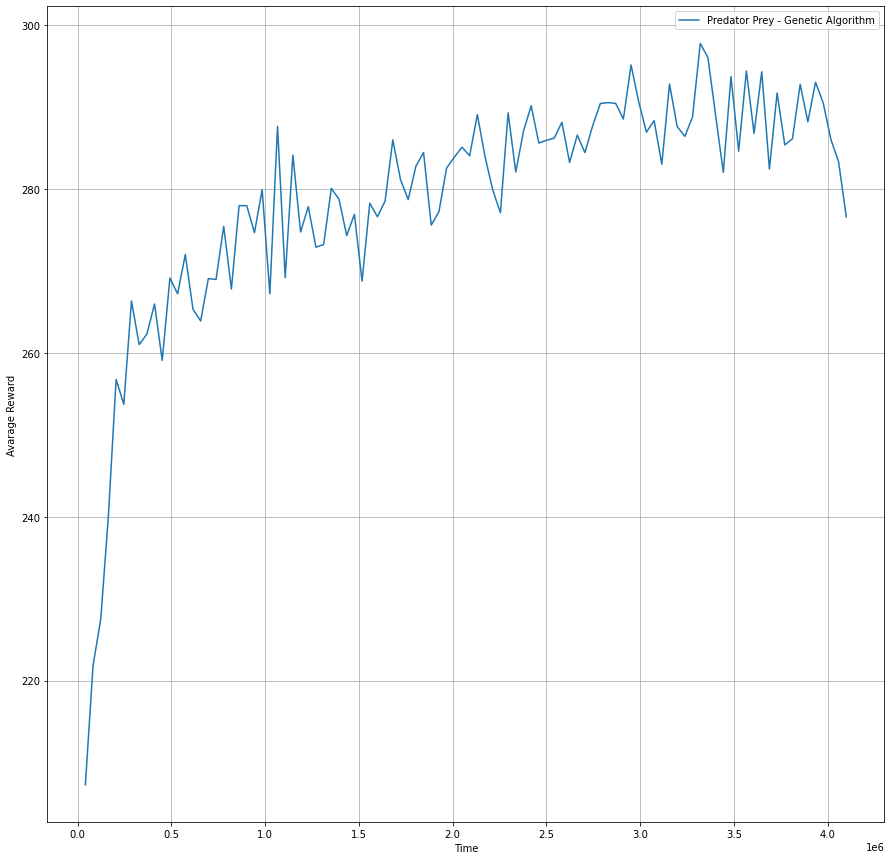
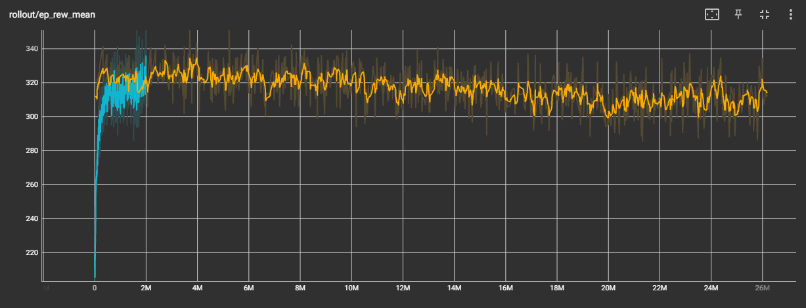
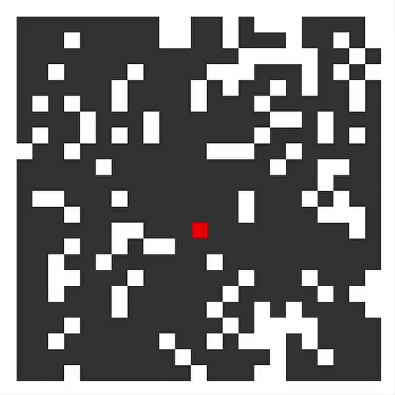

# Lotka Volterra Model with Predator-Policy

We want to create a predator prey model that predator has Policy. So, in first step, we need to create a environment with gym and insert my predator in this environment. Lets create a environment!

## Create environment with Gym 

In this lotka volterra model, we will consider 3 types of elements:

1) Predator - Our objetive is to insert a policy (Neural Network) in this agent. We will represent this element with number 1 in our array. 

2) Prey - This element will assume role of food to predator. We will represent this element with number 2 in our array.

3) Empty space - We will represent this element with number 0 in our array.

For more details about our environment, check two notebooks: `predator_prey_NN_model.ipynb` and `predator_prey_NN_model_PPO.ipynb`.

We use two types of RL algorithms to train predator policy: *Genetic Algorithms* and *Proximal Policy Optimization*. Lets check both of training:

### Genetic Algorithm:



Note that our predator policy was trained well. We can use this in our environment and simulations. But, we can try to better reward and train our predator policy with PPO. Lets check it!

### Proximal Policy Optimization:



We can see in tensorboard that our predator policy was better than Genetic Algorithm, because our reward was better with PPO algorithm. So, we must use this in our environment and simulations. 


## Simulations:

Now we have a policy in our predator agent. Lets check simulations in environment in two types of predator policy: Random Walker and Neural Network (Trained with PPO). See two videos below:

### Random Walker:



link to video: https://youtube.com/shorts/oZ86BUYbDQM

### Neural Network (Trained with PPO):


link to video: https://youtube.com/shorts/YRiek_6ZkGU

You can try to run simulation with policy predator in your terminal with this command:

```bash
python predator_prey.py 0 1 0 1
```

Check `predator_prey.py` for more details.

## Conclusions:

You can see in videos and simulations that our predator policy was trained to maximize reward. In other words, the predator will to maximize the number of prey that it can eat.


